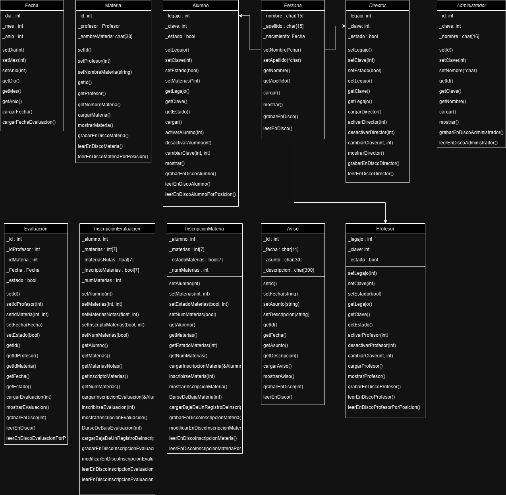

# Sistema de Gestión Educativa

## Introducción
El sistema permite gestionar la cursada mediante distintos perfiles (Alumno, Profesor, Directivo). Cuenta con un login y submenús específicos para cada rol, donde se podrán realizar distintas acciones acordes a sus funciones.

## Descripción Detallada del Sistema
El objetivo principal del programa es controlar la cursada independientemente del rol del usuario en la institución. La jerarquía de usuarios es la siguiente:

1. Administrador
2. Director
3. Profesor
4. Alumno

La primera vez que se ingrese a la aplicación, se utilizará un usuario ‘Administrador’. Esta opción es esencial para avanzar correctamente en el flujo del programa. Se generará automáticamente un “N° de legajo” y se solicitará una “contraseña” numérica. Los datos de autenticación se almacenan de forma segura en archivos `.dat`.

### Funcionalidades por Rol

#### Administrador
- **Gestión de Perfiles:**
  - Crear, activar y desactivar perfiles de Directores.
  - Blanquear contraseñas de Directores, Profesores y Alumnos.
  - Cambiar contraseña del usuario actual.
- **Gestión de Copias de Seguridad:**
  - Realizar y restaurar copias de seguridad de todos los archivos.

#### Director
- **Gestión de Perfiles:**
  - Crear, activar y desactivar perfiles de Profesores y Alumnos.
- **Gestión del Plan de Estudio:**
  - Cargar materias, asignar profesores y ver el plan de estudio.
- **Gestión de Avisos:**
  - Crear y ver avisos.
- **Cambiar contraseña del usuario actual.**

#### Profesor
- **Gestión de Materias:**
  - Ver materias asignadas, crear y ver exámenes finales, cargar notas.
- **Listados:**
  - Ver listados de alumnos inscriptos, aprobados y desaprobados.
- **Ver avisos y cambiar contraseña del usuario actual.**

#### Alumno
- **Gestión de Cursada:**
  - Ver planificación, anotarse y darse de baja en materias, anotarse y ver exámenes finales.
  - Ver el plan de estudio y los avisos.
  - Cambiar contraseña del usuario actual.

## Diagrama de Clases


## Instalación y Uso
1. Clonar el repositorio:
    ```bash
    git clone https://github.com/AlejoLg1/SGE.git
    ```
2. Compilar y Ejecutar el Proyecto a través de una IDE:
    
    - Abre tu entorno de desarrollo integrado (IDE) preferido, como Visual Studio Code, Code::Blocks, Eclipse, u otro.
    - Carga el proyecto clonado (SGE) dentro del IDE.
    - Configura el proyecto según las instrucciones específicas de configuración de cada IDE.
    - Compila y ejecuta el proyecto según las funciones proporcionadas por tu IDE.
      
3. Seguir las Instrucciones en Pantalla:
    - Una vez que el proyecto esté compilado y ejecutado correctamente, sigue las instrucciones que aparecen en pantalla para interactuar con el sistema de acuerdo al rol de usuario especificado.

## Licencia
Este proyecto está licenciado bajo los términos de la licencia MIT.

